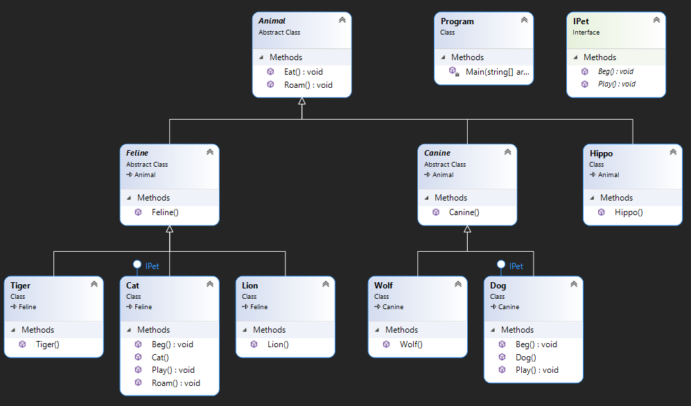

# C sharp inheritance example

Class diagram:



Main():

```csharp
// Create every type of animal object and assign references to a List
Console.WriteLine("Creating animal objects..");
List<Animal> animals = new List<Animal> {
    new Dog(),
    new Wolf(),
    new Cat(),
    new Lion(),
    new Tiger(),
    new Hippo()
};

// Loop through all animals and do stuff with them
foreach (Animal a in animals)
{
    Console.WriteLine();
    a.Eat();
    a.Roam();
    // if animal implements interface Pet it can be used as a Pet
    if (a is IPet p)
    {
        // or use type casting Animal a to Pet
        // Pet p = (Pet)a;
        p.Beg();
        p.Play();
    }
}
```

Output:

```cmd
Creating animal objects..
Canine created.
Dog created.
Canine created.
Wolf created.
Feline created.
Cat created.
Feline created.
Lion created.
Feline created.
Tiger created.
Hippo created.

Animal (Dog) eating.
Animal (Dog) roaming around..
Wufwuf, gimme the pizza now or I take it myself!
Dog is playing!

Animal (Wolf) eating.
Animal (Wolf) roaming around..

Animal (Cat) eating.
Cat sneaking...
Miau, gimme pizza, please!
Cat is playing!

Animal (Lion) eating.
Animal (Lion) roaming around..

Animal (Tiger) eating.
Animal (Tiger) roaming around..

Animal (Hippo) eating.
Animal (Hippo) roaming around..
```
